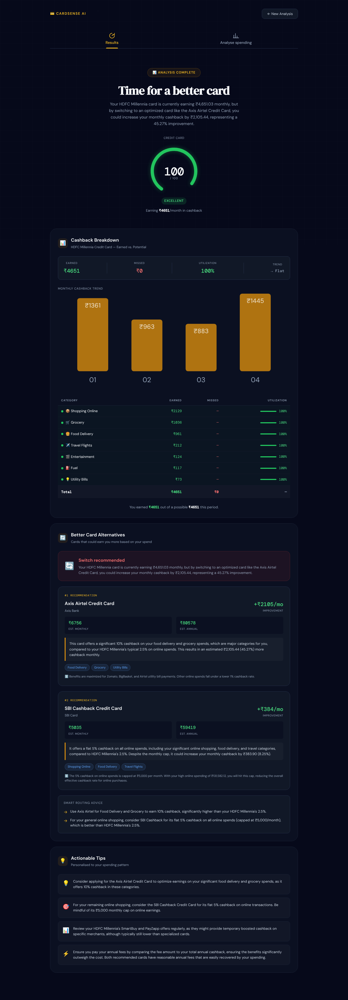
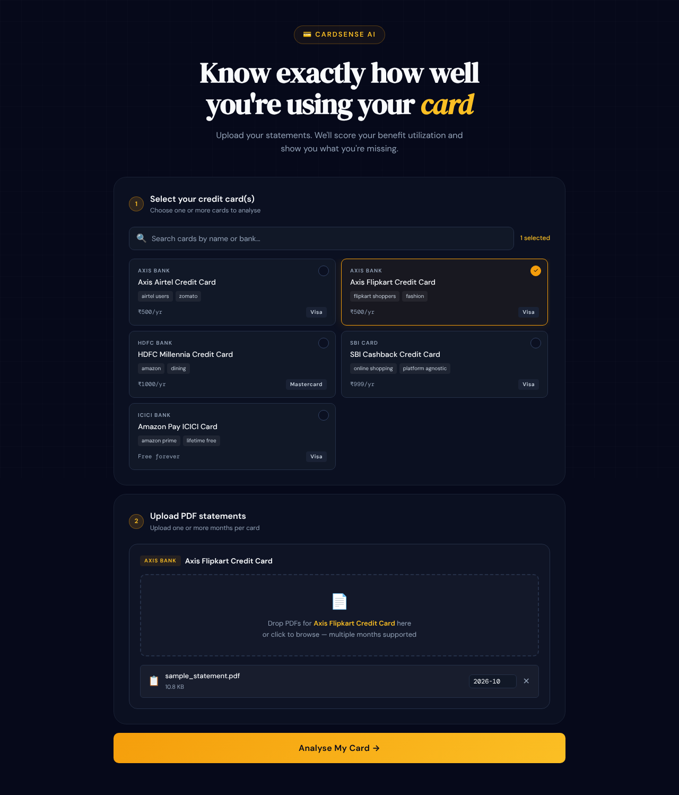
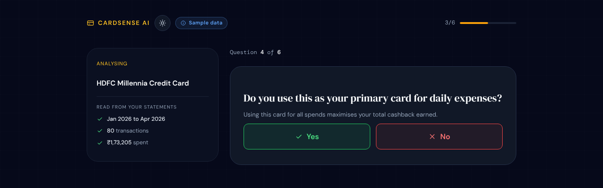
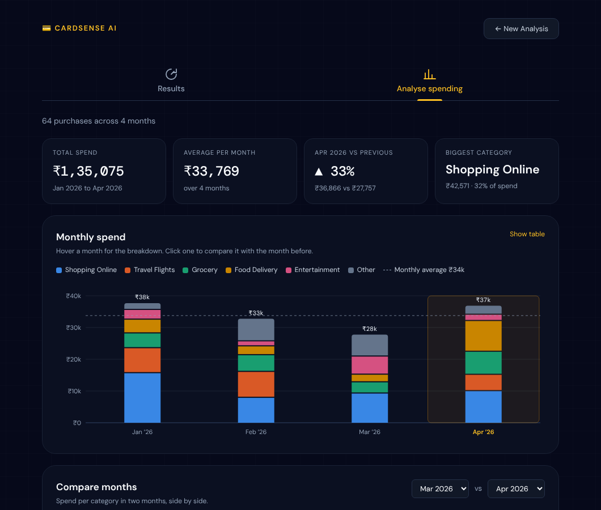
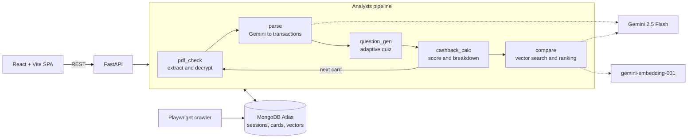

# CardSense AI

[](https://github.com/ypg199/cardsense-ai/actions/workflows/ci.yml)


[](eval/RESULTS.md)
[](eval/RESULTS.md)

**Upload your credit card statements, find out how much cashback you're leaving on the table, and see which card would earn you more.**

CardSense reads Indian credit card statement PDFs (including password-protected ones), extracts every transaction with an LLM, asks a few targeted questions about how you use the card, and scores your benefit utilization from 0 to 100. It then searches a database of cards by vector similarity and ranks better-fitting alternatives for your actual spending.

<p align="center">
  
</p>

<p align="center">
  
</p>

> The demo and screenshots use generated sample statements, not real financial data.

## Accuracy

Statement parsing is measured against 7 synthetic statements from **Axis, HDFC, ICICI and SBI** with known ground truth: 325 spending transactions covering password-protected PDFs, multi-page and 180-row statements, wrapped lines, foreign-currency rows, EMIs and refunds. Each statement is parsed 3 times with the real model.

| Metric | Result |
|---|---|
| Spending transactions found (recall) | **100%** |
| Extracted rows that are real (precision) | **100%** |
| Spending category correct | **99.3%** |
| Total spend error | **0.0%** |

The benchmark has already paid for itself: it caught long statements silently losing their last rows (169 of 180 found, a 7.7% spend error) and occasional malformed model replies dropping a whole statement. Both are fixed. Full report in [`eval/RESULTS.md`](eval/RESULTS.md), method in [`eval/README.md`](eval/README.md), and it reruns with `python -m eval.run_eval`.

---

## Features

- **Statement parsing with an LLM.** Gemini extracts transactions from free-form PDF text into a strict schema with 16 spending categories, so new bank layouts need no hand-written parser. Long statements are parsed in parts, and replies are requested as JSON and retried if invalid.
- **Encrypted PDF support.** Most Indian banks password-protect statements. CardSense detects this, asks for the password, and unlocks the file without ever storing the password.
- **Spend Analyser.** Interactive charts of monthly spend by category, a side-by-side comparison of any two months, top categories and merchants, and the largest purchases. Click a month or category to drill in, filter by card, or switch to a table view. It sits in an Analyse tab next to your results, or runs on its own: upload statements and go straight to the charts, with no card selection or quiz.
- **Multi-month and multi-card analysis.** Upload several months per card, or several cards in one session. Each card is analysed in turn, with a month-by-month trend.
- **Adaptive quiz.** Questions are generated from the card's reward rules and your detected spend. Anything already visible in the statement is confirmed automatically, so you only answer what the data can't tell.
- **Utilization score.** A 0–100 score with a per-category breakdown of cashback earned versus missed.
- **Card recommendations.** MongoDB Atlas Vector Search finds similar cards, a rule filter removes poor fits, and Gemini ranks the rest with a plain-language explanation and routing advice.
- **Card data crawler.** A Playwright crawler discovers card pages on Axis, HDFC, ICICI and SBI sites, extracts reward terms with Gemini, validates them against the categories the statement parser uses, and stores them with embeddings. Unchanged pages are skipped.

## Screenshots

| Upload | Quiz |
|---|---|
|  |  |

**Spend Analyser**



## Architecture



The pipeline is a set of small, independently tested nodes that each read and return a slice of a shared `AnalysisState`. The API drives them as a resumable state machine: the state is saved to MongoDB after every step, so the flow can pause for user input (a PDF password or a quiz answer) and pick up again on the next request.

## How it works

1. **Upload.** Pick your card(s) and drop statement PDFs. Files are checked for the `%PDF-` signature, size and count before anything else runs.
2. **Extract.** `pdfplumber` pulls the text, with PyMuPDF as a fallback. If the PDF is encrypted, the session pauses and the UI asks for the password.
3. **Parse.** Gemini 2.5 Flash converts the text into typed transactions (date, merchant, amount, category). Output is validated and unknown categories fall back to `others`.
4. **Quiz.** For each reward category, CardSense either confirms usage from the statement or asks a yes/no question.
5. **Score.** Cashback is computed per category from the card's reward rules, then:

   ```
   utilization_score = min(100, round(actual_earned / theoretical_max × 100))
   ```

   | Score | Label |
   |---|---|
   | 90–100 | Excellent |
   | 70–89 | Good |
   | 50–69 | Average |
   | 30–49 | Below average |
   | 0–29 | Poor |

6. **Compare.** Your spending profile is embedded and matched against card embeddings with Atlas Vector Search, filtered by rules (your current cards and travel or fuel cards that don't match your spend are dropped), and ranked by Gemini into a verdict, top recommendations and tips. If the vector index isn't available, it falls back to category filtering.

## Security and privacy

Statements are sensitive, so the defaults are conservative:

- **Sessions expire.** Each session has an `expires_at` date and a MongoDB TTL index deletes it after `SESSION_TTL_HOURS` (24 by default).
- **Passwords are never stored.** A PDF password is used only within the request that supplies it.
- **PDF bytes are discarded** as soon as the text is extracted. Encrypted bytes are held only while waiting for a password.
- **Uploads are validated** by file signature, size (`MAX_UPLOAD_MB`) and count (`MAX_FILES_PER_REQUEST`).
- **Admin endpoints need a key.** The crawler endpoints require an `X-Admin-Key` header (constant-time comparison) and are disabled when `ADMIN_API_KEY` is unset.
- **Search input is escaped** before it reaches a MongoDB `$regex`.
- **Errors stay internal.** Clients get generic messages, while tracebacks go to the server log.
- **Containers run as non-root** users.

## Tech stack

| Layer | Technology |
|---|---|
| Backend | Python 3.12, FastAPI, Pydantic, Motor (async MongoDB) |
| AI | Gemini 2.5 Flash via LangChain (parsing, questions, ranking), gemini-embedding-001 (768-dim vectors) |
| Data | MongoDB Atlas with Vector Search, TTL indexes |
| PDF | pdfplumber, PyMuPDF (fallback extraction and decryption) |
| Crawler | Playwright (Chromium) |
| Frontend | React 18, Vite, React Router |
| Tooling | pytest, pytest-cov, ruff, GitHub Actions |
| Deployment | Multi-stage Docker builds, nginx, Docker Compose |

## Getting started

### Prerequisites

- Docker with Docker Compose v2
- A MongoDB Atlas cluster (the free tier works)
- A Google Gemini API key ([get one here](https://aistudio.google.com/))

### 1. Configure

```bash
cp .env.example .env
# Fill in MONGODB_URI and GEMINI_API_KEY
```

| Variable | Purpose | Default |
|---|---|---|
| `MONGODB_URI` | Atlas connection string | required |
| `MONGODB_DB_NAME` | Database name | `cardsense` |
| `GEMINI_API_KEY` | Gemini API key | required |
| `ADMIN_API_KEY` | Enables the `/crawl` endpoints | unset (disabled) |
| `MAX_UPLOAD_MB` | Max size per PDF | `10` |
| `MAX_FILES_PER_REQUEST` | Max PDFs per upload | `12` |
| `SESSION_TTL_HOURS` | Session lifetime | `24` |
| `ALLOWED_ORIGINS` | Extra CORS origins for a deployed frontend, comma-separated | localhost only |

### 2. Run

```bash
docker compose up --build
```

| Service | URL |
|---|---|
| Frontend (nginx serving the React build) | http://localhost:3000 |
| API | http://localhost:8000 |
| API docs (Swagger) | http://localhost:8000/docs |

For hot reload while developing:

```bash
docker compose -f docker-compose.yml -f docker-compose.dev.yml up --build
```

### 3. Load card data

```bash
docker compose exec api python -m crawler.run --seed-only   # 5 sample cards
docker compose exec api python -m crawler.run               # crawl Axis, HDFC, ICICI and SBI (needs GEMINI_API_KEY)
docker compose exec api python -m crawler.run --sources axis hdfc   # selected banks only
```

The crawler finds each bank's card pages from its listing page, skips pages that haven't changed since the last run, and only stores benefits whose category and rate pass validation. Re-running it is cheap.

Then create a vector search index named `credit_cards_embedding_index` on `cardsense.credit_cards` in the Atlas UI:

```json
{
  "fields": [{ "type": "vector", "path": "embedding", "numDimensions": 768, "similarity": "cosine" }]
}
```

### Without Docker

```bash
python -m venv .venv && source .venv/bin/activate
pip install -r requirements-dev.txt
playwright install chromium
uvicorn api.main:app --reload --port 8000

cd frontend && npm install && npm run dev
```

## API

| Method | Path | Description |
|---|---|---|
| `POST` | `/session/start` | Upload PDFs for one or more cards and start the analysis (`mode=spend` stops after parsing, for the standalone Spend Analyser) |
| `POST` | `/session/{id}/password` | Unlock an encrypted statement |
| `POST` | `/session/{id}/answer` | Answer a quiz question |
| `GET` | `/session/{id}/status` | Current state, next question or results |
| `GET` | `/session/{id}/spend` | Spend by month, category and merchant for the Spend Analyser |
| `POST` | `/session/{id}/add_card` | Add another card to the session |
| `GET` | `/cards` | List cards |
| `GET` | `/cards/search?q=` | Search cards by name or bank |
| `GET` | `/cards/{card_id}` | Card details |
| `POST` | `/crawl` | Start a crawl (admin key) |
| `GET` | `/crawl/jobs` | Crawl job status (admin key) |
| `GET` | `/health` | Health check |

## Testing and CI

All 217 tests run offline. Gemini, MongoDB and Playwright are mocked, so no keys or services are needed.

```bash
pytest                                  # full suite with coverage config
pytest tests/test_cashback_node.py      # one suite
ruff check . && ruff format --check .   # lint and formatting
```

Every push and pull request runs GitHub Actions: lint and format checks, the test suite with a coverage floor, the frontend production build, and both Docker image builds.

## Project structure

```
agents/      Pipeline nodes (pdf, parse, question, cashback, compare), shared state, embeddings
api/         FastAPI app, settings, Pydantic models, routes (session, cards, crawl)
crawler/     Playwright crawler, bank sources, one-shot runner
db/          Motor connection, index setup (TTL and lookups), seed data
frontend/    React 18 + Vite app (upload, quiz, results with an Analyse tab, standalone Spend Analyser)
docker/      Production Dockerfiles and nginx template
eval/        Extraction accuracy benchmark: synthetic statements, scorer, results
tests/       pytest suites and a sample statement fixture
```

## Design decisions

- **LLM parsing instead of per-bank parsers.** Statement layouts vary by bank and change over time. A schema-constrained LLM call with validation handles new layouts without new code, and the category whitelist keeps output predictable.
- **Ask only what the statement can't answer.** Usage that's visible in the transactions is confirmed automatically, which keeps the quiz short.
- **Resumable pipeline persisted in MongoDB.** The flow needs to pause for passwords and answers across HTTP requests, so state lives in the database rather than in memory, which also keeps the API stateless and horizontally scalable.
- **Privacy by default.** Expiring sessions, no stored passwords and early disposal of PDF bytes mean a database leak exposes as little as possible.
- **Blocking SDK calls off the event loop.** The Gemini SDK is synchronous, so calls run in `asyncio.to_thread` to keep the API responsive under concurrent sessions.
- **Graceful degradation.** Without a vector index, comparison falls back to category filtering. Without a Gemini key, the API starts and reports a clear error instead of crashing.

## Roadmap

- Run the pipeline as a background job so uploads return immediately
- OCR fallback for scanned (image-only) statements
- More banks in the crawler, with scheduled refreshes
- Structured logging with request IDs and basic metrics
- Frontend tests with Vitest
